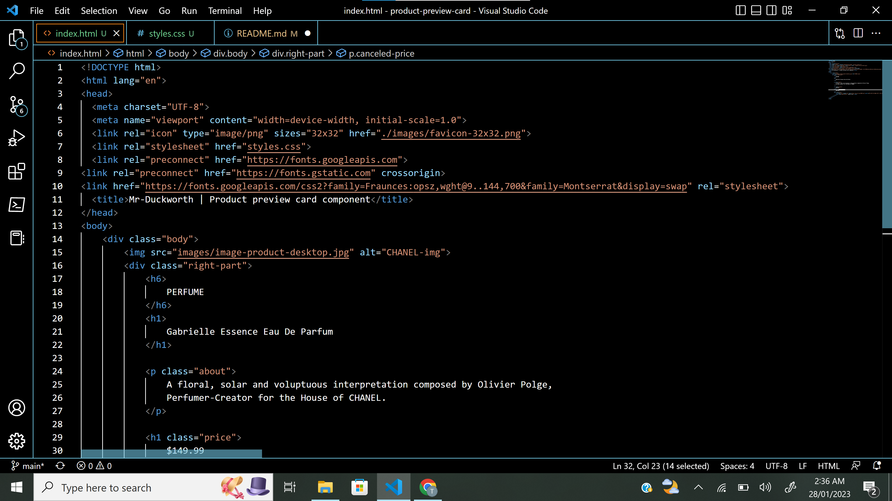
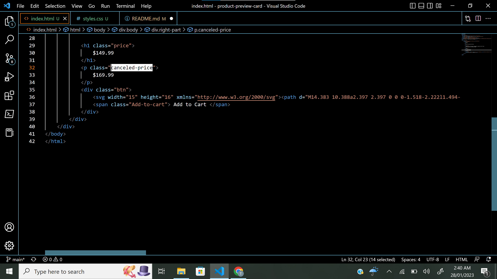
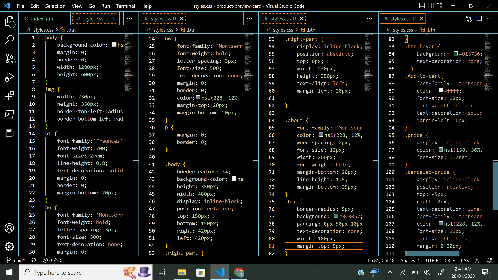
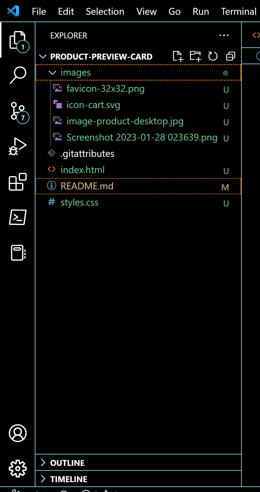

# Mr-Duckworth - Product preview card component solution

 A single webpage of a product preview card 

This is a solution to the [Product preview card component challenge on Frontend Mentor](https://www.frontendmentor.io/challenges/product-preview-card-component-GO7UmttRfa). Frontend Mentor challenges help you improve your coding skills by building realistic projects. 

## Table of contents

  - [Overview](#overview)
  - [The challenge](#the-challenge)
  - [Screenshot](#screenshot)
  - [Links](#links)
  - [My process](#my-process)
  - [Built with](#built-with)
  - [Continued development](#continued-development)
  - [Author](#author)

## Overview

### The challenge

Users should be able to:

- View the optimal layout depending on their device's screen size
- See hover and focus states for interactive elements

### Screenshot

### Links

- Live Site URL:(https://mr-duckworth.github.io/product-preview-card/)

## My process
My process is pretty simple, started out with html by breaking the whole code into divs and classing each divs and adding every needed html elements
Then i set the background color for the body after wish i added the image before editing the image and formatting the text and after that i started the styling to my satisfaction 
### Built with

- Semantic HTML5 markup
- CSS custom properties

### Continued development

Mostly css styling

## Author

- Website - [Aloba Tobiloba](https://www.your-site.com)
- Frontend Mentor - [Mr-Duckworth](https://www.frontendmentor.io/profile/Mr-Duckworth)
- Twitter - [@yourusername](https://www.twitter.com/ALife_OfPain)
